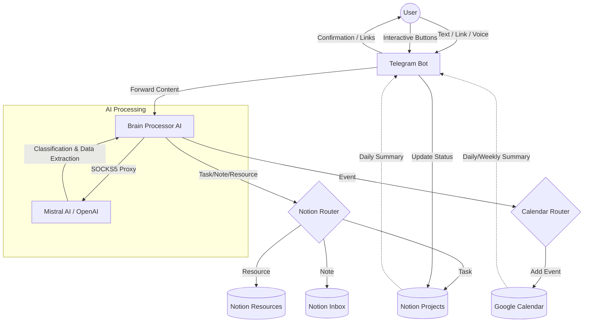

# AI Second Brain System (Telegram + Notion + Google Calendar)

An automated system to capture, classify, and route information from Telegram messages (text, voice, links) into structured Notion databases and Google Calendar using AI (Mistral/OpenAI).

## 🧠 System Architecture



## 🚀 Features

- **Multi-modal Capture**: Supports text, voice messages (Whisper transcription), and web links.
- **AI Classification**: Automatically sorts inputs into PARA-style categories (Projects, Resources, Inbox) or Calendar Events.
- **Google Calendar Integration**:
  - **Read**: Daily summaries and Weekly schedule (`/week`).
  - **Write**: Natural language event creation (e.g., "Meeting tomorrow at 5pm").
- **Interactive Tasks**: Mark Notion tasks as "Done" directly from Telegram using inline buttons.
- **PARA Methodology**: Built-in support for Projects, Areas, Resources, and Archives.

## 🛠️ Setup

### 1. Requirements
- Python 3.10+
- SSH SOCKS5 Tunnel (for Mistral/Restricted API access)
- Notion API Integration
- Google Cloud Project (for Calendar API)

### 2. Installation
```bash
# Initialize virtual environment
python -m venv venv
.\venv\Scripts\activate

# Install dependencies
pip install -r requirements.txt
```

### 3. Configuration (.env)
Create a `.env` file with the following:
```env
TELEGRAM_BOT_TOKEN=your_token
TELEGRAM_USER_ID=your_id
NOTION_TOKEN=your_token
NOTION_INBOX_ID=your_id
NOTION_PROJECTS_ID=your_id
NOTION_RESOURCES_ID=your_id
AI_PROVIDER=mistral # or openai
MISTRAL_API_KEY=your_key
SOCKS5_PROXY=socks5://127.0.0.1:1080
SUMMARY_TIME=09:00
```

### 4. Google Calendar Setup
1. Enable Google Calendar API in Cloud Console.
2. Download `credentials.json` and place it in the root directory.
3. Run the bot; it will prompt you for an authorization link on first run.

### 4. Running the Bot
```bash
# 1. Start your SSH tunnel (if using proxy)
ssh -D 1080 -N user@your_vps_ip

# 2. Run the bot
python bot.py
```

## 🛠️ Utilities
- `find_notion_ids.py`: Automatically list your Notion database IDs.
- `calendar_api.py`: Independent module for testing Google Calendar.

---
*Inspired by Tiago Forte's Building a Second Brain.*
