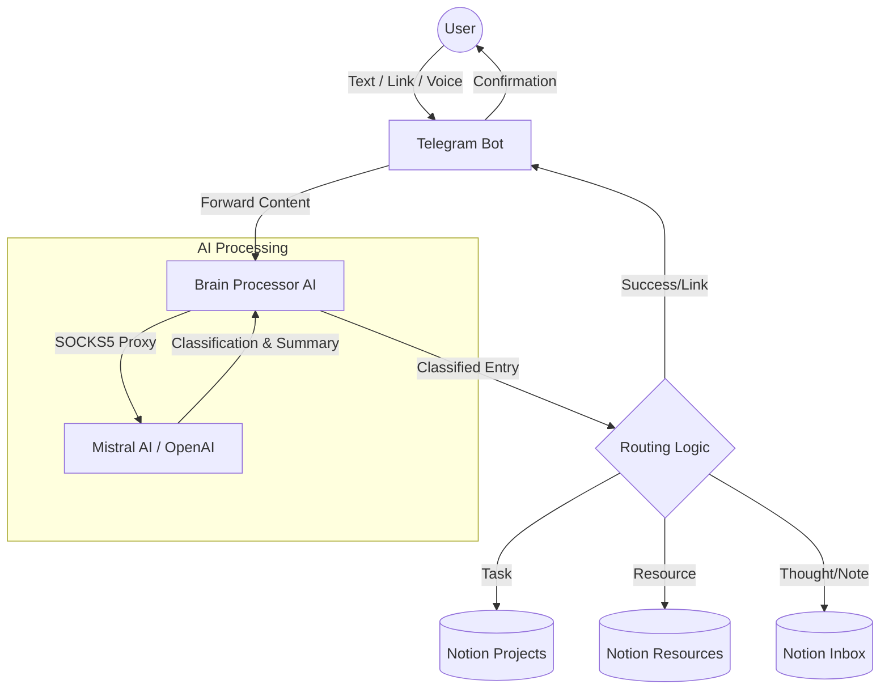

# AI Second Brain System (Telegram + Notion)

An automated system to capture, classify, and route information from Telegram messages (text, voice, links) into structured Notion databases using AI (Mistral/OpenAI).

## 🧠 System Architecture



## 🚀 Features

- **Multi-modal Capture**: Supports text, voice messages (transcription via Whisper), and web links.
- **AI Classification**: Automatically sorts inputs into PARA-style categories (Projects, Resources, Inbox).
- **Mistral + Proxy Support**: Configured to work with Mistral AI via SSH SOCKS5 tunnel to bypass regional restrictions.
- **Notion Integration**: Direct page creation in specific databases with summaries and tags.

## 🛠️ Setup

### 1. Requirements
- Python 3.10+
- SSH SOCKS5 Tunnel (for Mistral)
- Notion API Integration

### 2. Installation
```bash
# Initialize virtual environment
python -m venv venv
.\venv\Scripts\activate

# Install dependencies
pip install -r requirements.txt
```
*(Note: I've created the requirements in the environment, you can generate them using `pip freeze > requirements.txt`)*

### 3. Configuration (.env)
Create a `.env` file with the following:
```env
TELEGRAM_BOT_TOKEN=your_token
NOTION_TOKEN=your_token
AI_PROVIDER=mistral
MISTRAL_API_KEY=your_key
SOCKS5_PROXY=socks5://127.0.0.1:1080
```

### 4. Running the Bot
```bash
# 1. Start your SSH tunnel in a separate terminal
ssh -D 1080 -N root@your_vps_ip

# 2. Run the bot
.\venv\Scripts\python.exe bot.py
```

## 🛠️ Utilities
- `find_notion_ids.py`: Run this to automatically list your Notion database IDs for the `.env` file.

---
*Inspired by the Second Brain system for optimized digital capture.*
