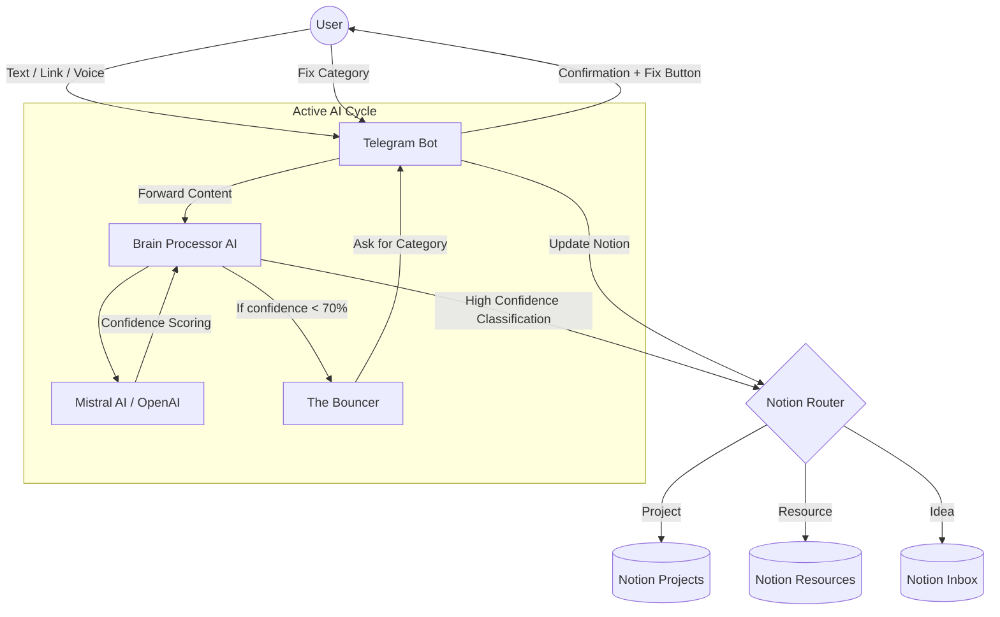

# AI Second Brain 2026 (Telegram + Notion + Google Calendar)

An advanced automated system to capture, classify, and route information from Telegram into structured Notion databases and Google Calendar. Built on the **Active AI Cycle** principles from the "Second Brain 2026" guide.

## 🧠 System Architecture (Second Brain 2026)



## 🚀 Key Features (Active AI Cycle)

- **The Bouncer (Confidence Filter)**: AI evaluates its own certainty. If unsure, it stops and asks you for clarification instead of creating messy data.
- **The Fix Button (Instant Correction)**: Every saved item includes an interactive button to instantly re-categorize if the AI made a mistake.
- **Advanced Scraping**: Link inputs trigger a full-page scrape (via `httpx` and `bs4`) to provide a semantic summary in Notion.
- **Next Action Sync**: Automatically extracts "Next Action" for projects and syncs it to a dedicated Notion database property.
- **To-Do Dashboard**: Built-in `/todo` command to view all active tasks and their next actions directly in Telegram.
- **The Receipt (Audit Logs)**: Local `audit_log.json` records all AI decisions for transparency and debugging without third-party tools.
- **Multi-modal Capture**: Supports text, voice messages (Whisper), and web links.
- **Docker Ready**: Fully containerized for VPS deployment.

## 🛠️ Setup

### 1. Requirements
- Docker & Docker Compose
- Notion API Integration
- Google Cloud Project (for Calendar API)

### 2. Configuration (.env)
Create a `.env` file with the following:
```env
TELEGRAM_BOT_TOKEN=your_token
TELEGRAM_USER_ID=your_id
NOTION_TOKEN=your_token
NOTION_INBOX_ID=your_id
NOTION_PROJECTS_ID=your_id
NOTION_RESOURCES_ID=your_id
AI_PROVIDER=mistral # or openai
MISTRAL_API_KEY=your_key
SUMMARY_TIME=09:00
```

### 3. Google Calendar Setup
1. Enable Google Calendar API in Cloud Console.
2. Download `credentials.json` and place it in the root directory.
3. Run the bot locally once to generate `token.json` via interactive login.

### 4. Running the Bot (Docker)
```bash
# Build and start the container in background
docker compose up -d --build

# View logs
docker compose logs -f
```

## 🛠️ Utilities
- `find_notion_ids.py`: Automatically list your Notion database IDs.
- `calendar_api.py`: Independent module for testing Google Calendar.

---
*Inspired by Tiago Forte's Building a Second Brain.*
